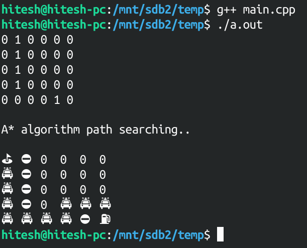
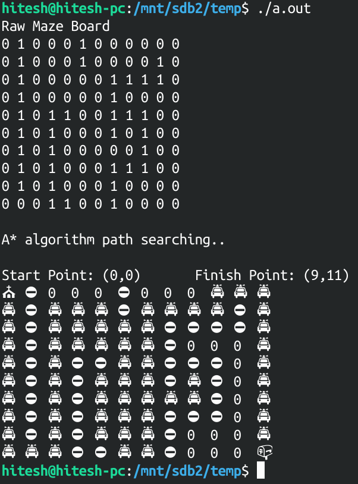

# A* Search Algorithm in c++

A beautiful implementation of A* route search algorithm.

**A* Algo:** A* algorithm is a searching algorithm that searches for the shortest path between the initial and the final state. It is used in various applications, such as maps.

In maps the A* algorithm is used to calculate the shortest distance between the source (initial state) and the destination (final state).

It is most popular choice for path finding by robots. 

Worst complexity: O(|E|)

Space complexity: O(|V|)

Simple maze of 6x6 with obstacles:

Maze of 9x12 with obstacles:

